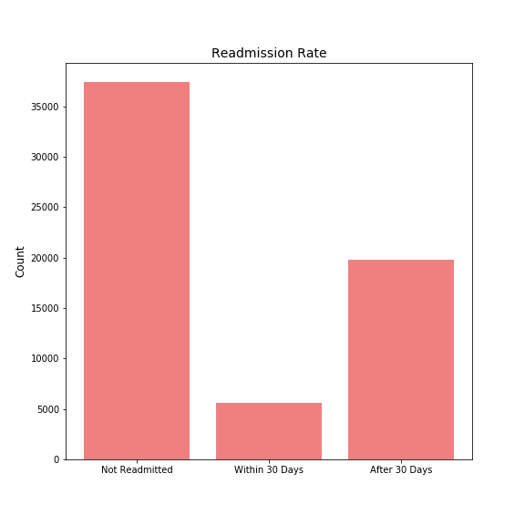
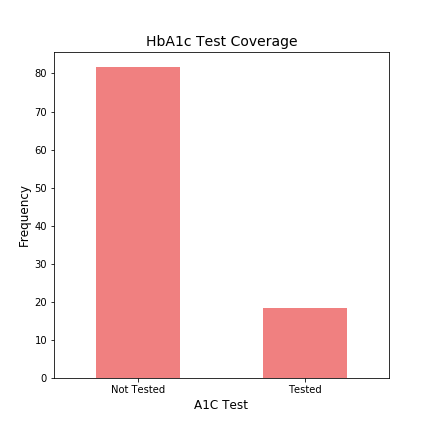
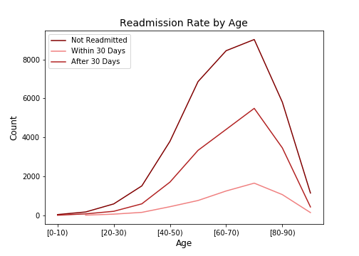

# Diabetes Hospitalizations

Jean-Paul Ventura 

## Introduction

Diabetes affects 30 million Americans, almost 10% of the population, as of 2015. It is a family of diseases that affects how your body can utilize blood sugar (specifically, glucose). While vital for powering your cells, a buildup of glucose in the blood can lead to serious health problems. Type I diabetes usually emerges pre-adolescence and is characterized by one's immune system incorrectly targeting insulin-producing cells. Type II can emerge at any age and is characterized by cells becoming resistent to insulin binding. This keeps glucose from being transported into the cells and causes a buildup of glucose in the blood. 

There are a plethora of factors that impact diabetes, including genetics and environmental factors. Family history is the driving factor for Type I diabetes. For Type II diabetes, in addition to family history, there are many more environmental factors, such as weight, inactivity, age, race, and other underlying health concerns. 

HbA1c is a measure of how glycated one's red blood cells are. This gives a better picture of glucose levels over a few months, rather than a single point test like blood glucose levels. For diabetics, just a 1% increase in HbA1c can increase microvascular complications by 25%. 

## The Model

I used a logistic regression model to enable interpreting our coefficients and drawing relative comparisons between features. A non-polynomial model performed best and allowed for easier interpretation of coefficients. I also tried a decision tree model, but it consistently performed worse than our logistic regression even after iterative improvments using SMOTE, tomek links, and gridsearch. 

### Data Collection & Cleaning

The data set was a subset of some 75 million inpatient visits between 1998 and 2008. The specific dataset consists of 100,000 inpatient visits for only diabetic patients. Because this set spans ten years, I had to remove repeat visits as some patients were admitted several times in that period. The datset also had 25 features for specific diabetic treatments that had to be dropped as many were not used by any of our observations.

 

### Feature Engineering

I observed that the effect of age on readmittance was clearly different between different age ranges. Therefore, I binned age into 0-30, 30-60, and 60-100 categories. Various diagnoses were reported when patients were admitted inpatient via ICD-9 medical billing codes, but only the first three were listed. It was intractable to use get_dummies due to the sheer number of possible diagnoses observed. Therefore, I created columns for if diabetes (ICD-9 code 250.xx) was listed as one of the top diagnoses.

From outside research, I know that the HbA1C test is very important for assessing long-term management of glucose levels in the blood. However, less than 20% of inpatient visits resulted in a HbA1c test. Furthermore, if a patient was given a HbA1c test, one would hope that patient's medication would be adjusted if necessary. Having a feature for 'Change in Meds' I was able to engineer a feature for when a patient likely needed an adjustment and if it was done or not. 

 

## Insights and Suggestions

The main insight is that patients listed with diabetes as a top diagnosis for their inpatient visit were more likely to be later readmitted, both within and after 30 days. Therefore, steps that could lower diabetic visits would reduce rates of readmission. This is generally accomplished through routine testing of blood sugar levels and, less often, HbA1c tests to measure long-term glucose levels. Of diabetic patients, only 18.5% received a HbA1c test and of those, more than 50% had a change in medication during the visit, presumably due to their results. Indeed, patients who received a normal HbA1c result were less likely to be readmitted. 

 

Age also played a large part in readmission rate. Generally, older patients had higher rates than younger patients. Patients 60-100 were more likely to be readmitted within 30 days, and patients 0-30 were less likely to be readmitted in either case. While not surprising, physicians should focus on testing older patients with HbA1c. 

Interestingly, patients who did not receive even the daily, point blood sugar test were less likely to be readmitted within 30 days, but more likely to be readmitted after 30 days. This is potentially because arising issues went undiscovered during the inpatient visit necessitating a later visit.

## Future Directions

I encourage physicians to offer both blood sugar and HbA1c tests for all diabetic inpatient visits regardless of the main cause of visit. Frequent testing will better capture emerging complications than waiting for adverse symptoms. This sort of preventative testing is done in ICUs already because of the clear health benefits, but it could be utilized in all inpatient cases.

Even with more than 60,000 observations, our dataset greatly underestimates the true population of diabetic patients in the United States. An interesting next step would be to incorporate financial elements to the analysis. Diabetes treatment is quite expensive for the individual, on average $17,000 per year per patient, and for society, $1 of every $4 healthcare spending is diabetes-related. We would attempt to assign cost/benefit analysis to various testing and treatment options to optimize care and minimize costs.